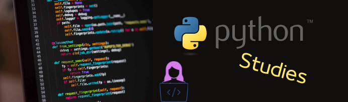

Repositório com scripts em Python de estudos pessoais

1. Listas de atividades  
&emsp; a. Funções básicas em Python 
&emsp; b. Estrutura de repetição  
&emsp; c. Importações de bibliotecas 
&emsp; d. split( ) e append( )  
2. Projeto de Análise de dados - Top 100 músicas Spotify(2010 - 2019) 
&emsp; a. Gráfico de Barras 
&emsp; b. Gráfico de Linhas 
&emsp; c. Gráfico de Rosca