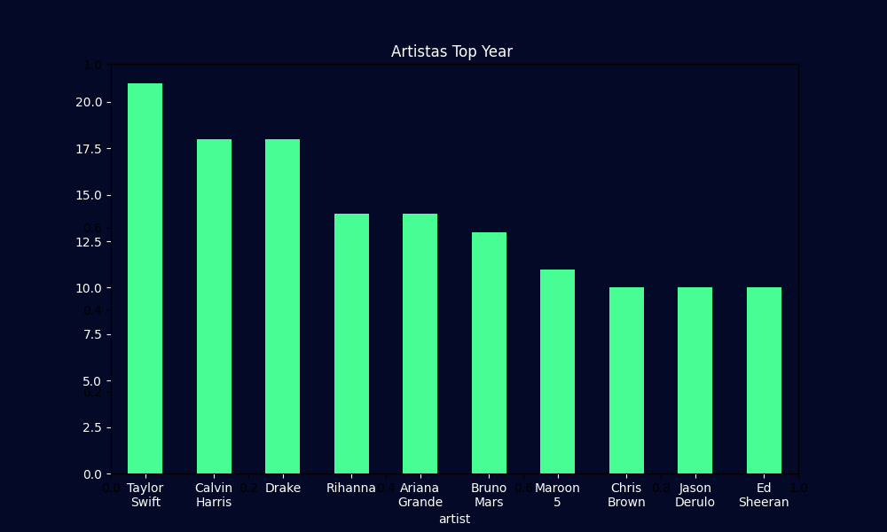
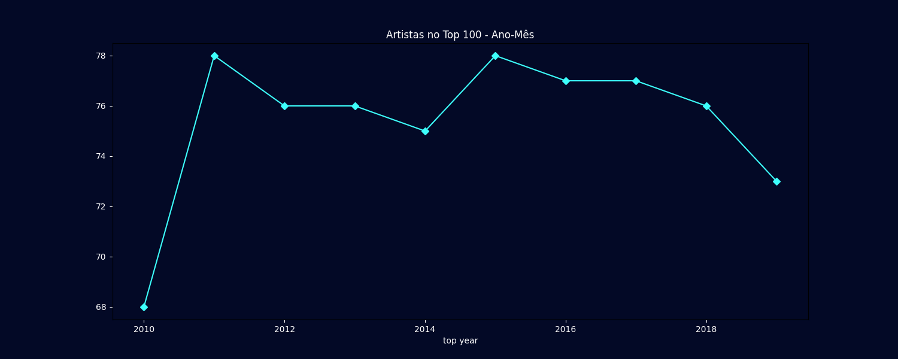
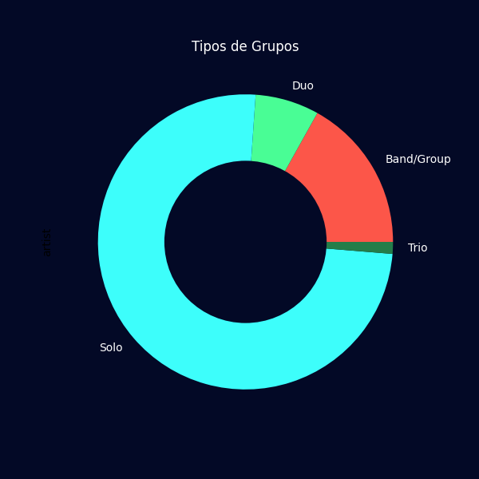

  

<h1 align="center">Repositório com scripts em Python de estudos pessoais</h1>

<h4>1. Listas de atividades  
&emsp; a. Funções básicas em Python 
&emsp; b. Estrutura de repetição  
&emsp; c. Importações de bibliotecas 
&emsp; d. split( ) e append( )  

2. Projeto de Análise de dados - Top 100 músicas Spotify(2010 - 2019) 
&emsp; a. Gráfico de Barras 
&emsp; b. Gráfico de Linhas 
&emsp; c. Gráfico de Rosca </h4>

<h2 align="center">Análise dos Dados</h2>

  Esse gráfico mostra os 10 artistas mais famosos entre 2010 e 2019 considerando a quantidade de músicas do artista que estiveram no top 100 no decorrer dos anos. Temos como resultado desse gráfico os 10 artistas mais populares da década! Tendo como artista mais popular a Taylor Swift, esse gráfico pode ser complementado com os artistas mais populares dentro do seu próprio gênero musical, removendo disparidades de gêneros mais famosos como o Pop. 
  
  

   
 
 O segundo gráfico indica a quantidade de artistas no Top Hits de cada ano, considerando que sempre foram 100 músicas mais ouvidas no ano, o ano de 2010 teve uma menor variedade de artistas comparado com os outros anos, os maiores picos foram em 2011 e 2015, voltando a diminuir a partir de 2017, uma análise complementar que pode ser feita baseada nesses dados é a verificação de quais artistas estão presentes nos anos de pouca variedade e qual foi a proporção de perda de popularidade no ano seguinte. 
  
  

   
 
 Esse último gráfico indica a preferência do público por artistas solo, apesar da fama histórica de boy bands e o aparente interesse de ouvintes por bandas, na prática os artistas solos estão muito mais presentes nas músicas mais ouvidas do que aparenta, sendo os menos populares os de trio, a pergunta a ser feita é: Seria a quantidade de artistas trio menores que a dos outros ou esse modelo de equipe não atrai o público.  
  
 

  

  <h4>Conclusão</h4> 
  Com esses dados históricos e outros complementares pode-se fazer uma análise do mercado musical e fazer a escolha de que tipo de artista investir, perfis preferidos pelo público e outros temas, podendo ser úteis para ou produtor musical ou investidores do setor da música, auxiliando na escolha baseado nos dados e sendo o perfil mais adequado para o momento.

  
